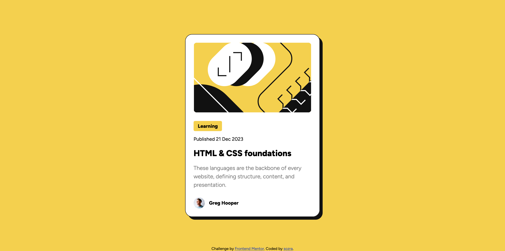
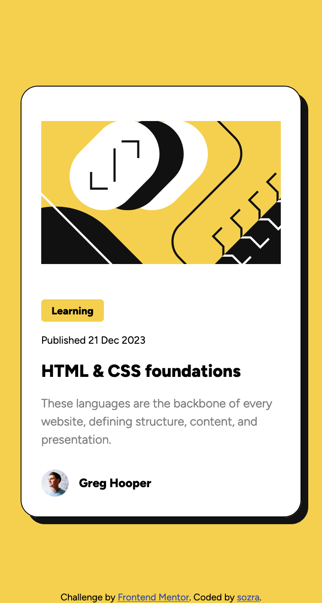

# Frontend Mentor - Blog preview card solution

This is a solution to the [Blog preview card challenge on Frontend Mentor](https://www.frontendmentor.io/challenges/blog-preview-card-ckPaj01IcS). Frontend Mentor challenges help you improve your coding skills by building realistic projects. 

## Table of contents

- [Frontend Mentor - Blog preview card solution](#frontend-mentor---blog-preview-card-solution)
  - [Table of contents](#table-of-contents)
  - [Overview](#overview)
    - [The challenge](#the-challenge)
    - [Screenshot](#screenshot)
    - [Links](#links)
  - [My process](#my-process)
    - [Built with](#built-with)
    - [What I learned](#what-i-learned)
    - [Continued development](#continued-development)
  - [Author](#author)

**Note: Delete this note and update the table of contents based on what sections you keep.**

## Overview

### The challenge

Users should be able to:

- See hover and focus states for all interactive elements on the page

### Screenshot





### Links

- Solution URL: [github](https://github.com/sozra/FM_Blog-preview-card)
- Live Site URL: [github pages](https://sozra.github.io/FM_Blog-preview-card/)

## My process

### Built with

- vanilla HTML and CSS
- Flexbox
- :has() selector for title hover animation
- clamp() for dynamic font sizes


### What I learned

1. some basic usage of figma
2. centering  element using `absolute` and `inset` syntatic sugar
   ```css
        position: absolute;
        inset: 0px;
    ```
3. using multiple box-shadow rather than border to be closer to the element pixels of the figma
4. Even I set the margin and padding of the image element to both 0, there is still a small gap between it and other element. I think it might be because of the dafualt flow layout or inline layout, and I change the display of the  to flex, and it works fine now.
5. Initially I used media query for the font size change, then I notice the chanllenge tests me to change font without media query. Then I search and use the clamp() function for dynamic font size. I think there is some better ways but I can't find out.
6. when hover on title, the shadow of the card changes. I use clamp() for this effect, but as I know it's quite new especially for FireFox. I wonder if there are some other solutions.


### Continued development

1. absolute element centering tricks
2. :has() selector
3. clamp() function 


## Author

- Frontend Mentor - [@sozra](https://www.frontendmentor.io/profile/sozra)


